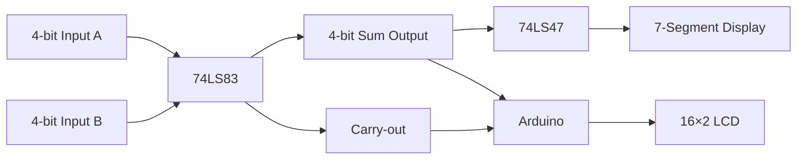

# 4-Bit-Hardware-Adder

## Overview
This project implements a **4-bit binary adder** using discrete logic ICs with dual-display output. It extends the classic 2-bit adder concept with significant hardware improvements, including a dedicated 4-bit adder IC (74LS83) and BCD-to-7-segment decoder (74LS47). The system provides both binary visualization via 7-segment display and decimal results through an LCD interface.

## Key Features
- **4-Bit Binary Addition**: Handles values 0-15 for both inputs
- **Dual Display System**:
  - 7-Segment Display: Shows binary result via segment illumination
  - LCD Screen: Displays decimal sum and binary equivalent
- **Carry Detection**: Visual indicator for overflow (sums >15)
- **Hardware-Optimized Design**:
  - 74LS83 4-bit adder IC replaces discrete gates
  - 74LS47 decoder simplifies 7-segment control
  - Expanded 8-position DIP switch for 4-bit inputs
- **Educational Focus**: Demonstrates fundamental digital logic concepts

## Hardware Components
| Component | Quantity | Purpose |
|-----------|----------|---------|
| Arduino UNO | 1 | LCD interface and result processing |
| 74LS83 IC | 1 | 4-bit binary addition |
| 74LS47 IC | 1 | 7-segment display driver |
| 8-Position DIP Switch | 1 | Input for A (4 bits) and B (4 bits) |
| Common Anode 7-Segment Display | 1 | Binary result visualization |
| 16×2 LCD with I2C | 1 | Decimal result display |
| 10kΩ Resistors | 8 | DIP switch pull-down resistors |
| 330Ω Resistors | 8 | Current limiting for LEDs |
| Breadboard | 1 | Circuit prototyping |
| Jumper Wires | - | Component interconnections |

## Setup and Operation
1. **Hardware Assembly**:
   - Connect DIP switches to 74LS83 inputs (A0-A3, B0-B3) with pull-down resistors
   - Wire 74LS83 outputs (Σ0-Σ3) to 74LS47 inputs and Arduino analog pins
   - Connect 74LS47 outputs to 7-segment display through current-limiting resistors
   - Interface LCD with Arduino via I2C

2. **Firmware Upload**:
   - Load `firmware/adder_display.ino` to Arduino
   - Verify I2C address matches LCD module (default: 0x27)

3. **Operation**:
   - Set input values using DIP switches (4 bits for A, 4 bits for B)
   - Observe results:
     - 7-segment displays binary result
     - LCD shows decimal sum and binary equivalent
     - Carry LED illuminates for sums >15

## Theory of Operation
The adder implements binary addition using these principles:

Key mathematical relationships:
- Sum range: 0 (0000) to 30 (11110)
- Total value = (Σ0-Σ3) + (16 × C_out)
- Overflow occurs when C_out = 1 (result >15)

## Documentation
For detailed information:
- [Component Specifications](hardware/bill_of_materials.md)
- [Circuit Schematics](hardware/schematics/)
- [Adder Theory](docs/theory.md)

## Educational Value
This project demonstrates:
1. Binary arithmetic fundamentals
2. Integrated circuit applications
3. Digital display systems
4. Hardware/software interfacing
5. Logic gate implementation

## Future Extension Ideas
1. Expand to 8-bit addition using two 74LS83 ICs
2. Implement subtraction with 2's complement
3. Add signed number support
4. Create PCB version for permanent installation
5. Interface with keypad for numeric input

## License
This project is licensed under the MIT License - see the [LICENSE](LICENSE) file for details.
