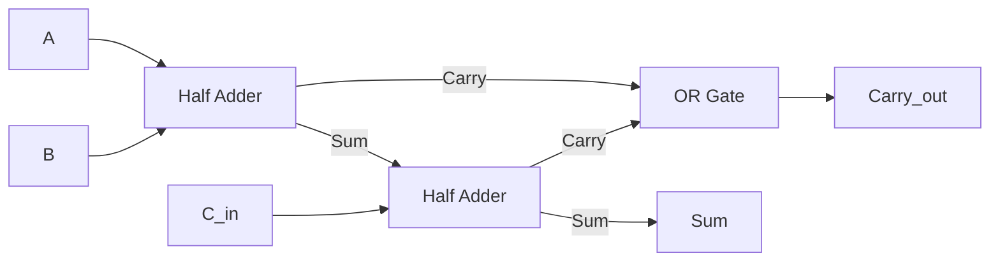
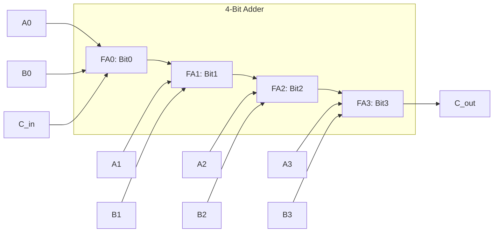

# Theory of Operation: 4-Bit Binary Adder

## 1. Binary Number Representation
Computers use the **binary number system** (base-2) for all arithmetic operations. In this system:
- Each digit is called a **bit** (binary digit)
- A 4-bit number can represent values from 0 (0000) to 15 (1111)
- Each bit position has a specific weight:

| Bit Position | Weight | Decimal Value |
|-------------|--------|--------------|
| 0 (LSB)     | 2⁰     | 1            |
| 1           | 2¹     | 2            |
| 2           | 2²     | 4            |
| 3 (MSB)     | 2³     | 8            |

**Example**:  
Binary `1101` = (1 × 8) + (1 × 4) + (0 × 2) + (1 × 1) = 13

## 2. Binary Addition Fundamentals
Binary addition follows the same principles as decimal addition but with only two digits (0 and 1). The rules:

| A | B | Sum | Carry |
|---|---|-----|-------|
| 0 | 0 | 0   | 0    |
| 0 | 1 | 1   | 0    |
| 1 | 0 | 1   | 0    |
| 1 | 1 | 0   | 1    |

When adding multi-bit numbers, carries propagate from LSB to MSB.

## 3. Adder Circuit Components
### 3.1 Half Adder
- Adds two single bits
- Outputs: **Sum** (XOR) and **Carry** (AND)
- Logic Equations:
  - Sum = A ⊕ B
  - Carry = A • B

### 3.2 Full Adder
- Adds two bits plus carry-in
- Implemented using two half-adders and OR gate
- Logic Equations:
  - Sum = A ⊕ B ⊕ C<sub>in</sub>
  - Carry = (A • B) + (B • C<sub>in</sub>) + (A • C<sub>in</sub>)



### 3.3 4-Bit Ripple Carry Adder (74LS83)
- Chains four full adders
- Carry output from each stage feeds into next
- Characteristics:
  - Simple but relatively slow (carry propagation delay)
  - Maximum delay = 4 × full-adder delay
  - Supports 4-bit addition with carry-in and carry-out

**Logic Diagram**:


## 4. Display Systems
### 4.1 BCD to 7-Segment Decoding (74LS47)
- Converts 4-bit binary input to 7-segment patterns
- BCD (Binary Coded Decimal) range: 0000 (0) to 1001 (9)
- For values 10-15, displays hexadecimal characters (A-F)
- Truth Table:

| Binary | Hex | Display | Segments (a-g) |
|-------|-----|---------|----------------|
| 0000  | 0   | 0       | 1111110        |
| 0001  | 1   | 1       | 0110000        |
| ...   | ... | ...     | ...            |
| 1001  | 9   | 9       | 1110011        |
| 1010  | A   | A       | 1110111        |
| ...   | ... | ...     | ...            |
| 1111  | F   | F       | 1000111        |

### 4.2 Binary Visualization Mode
- Direct mapping of bits to segments:
  - Segment a = Σ0 (LSB)
  - Segment b = Σ1
  - Segment c = Σ2
  - Segment d = Σ3 (MSB)
- Segments e, f, g remain OFF
- Example: Binary 1011 → Segments a,b,d ON

## 5. Mathematical Foundation
The adder implements:
```
Σ = A + B + C_in
```
Where:
- A and B are 4-bit inputs
- C_in is carry-in (typically 0)
- Σ is the 4-bit sum output
- C_out = 1 if A + B + C_in ≥ 16

**Value Range**:
- Minimum: 0 + 0 = 0
- Maximum: 15 + 15 = 30 (11110 in binary)

**Overflow Handling**:
- C_out indicates overflow (result > 15)
- Total value = Σ + (16 × C_out)

## 6. Circuit Operation Sequence
1. **Input**: User sets 8-bit input via DIP switches (4 bits for A, 4 bits for B)
2. **Addition**: 74LS83 computes Σ0-Σ3 and C_out
3. **Binary Display**:
   - 74LS47 decodes Σ0-Σ3 to 7-segment pattern
   - Segments show numeric/hex value
4. **Decimal Display**:
   - Arduino reads Σ0-Σ3 and C_out
   - Calculates total = (Σ0-Σ3) + (16 × C_out)
   - Shows result on LCD
5. **Carry Visualization**: LED lights when C_out = 1

## 7. Practical Considerations
1. **Propagation Delay**:
   - 74LS83 typical delay: 15ns per stage
   - Maximum delay: 60ns for full 4-bit addition

2. **Power Requirements**:
   - 74LS series ICs: 5V ±5%
   - Current consumption: 8-16mA per IC

3. **Signal Integrity**:
   - Use decoupling capacitors (0.1μF) near ICs
   - Keep digital traces short (<10cm)
   - Avoid parallel routing of clock and data lines

## 8. Applications and Extensions
1. **Educational Applications**:
   - Digital logic laboratories
   - Computer architecture courses
   - STEM outreach programs

2. **Industrial Applications**:
   - Calculator ALUs
   - Digital counters
   - Checksum generators

3. **Possible Extensions**:
   ```mermaid
   graph LR
       Current[4-Bit Adder] --> Expand[8-Bit Adder]
       Current --> Sub[Subtraction Circuit]
       Current --> Signed[Signed Arithmetic]
       Current --> Multiplier[Multiplier Circuit]
       Expand --> Processor[Simple CPU Design]
   ```

**Key Extension Notes**:
- **8-Bit Adder**: Cascade two 74LS83 ICs (connect C_out to C_in of next stage)
- **Subtraction**: Use 2's complement (invert B and set C_in = 1)
- **Multiplication**: Implement with shift-and-add algorithm
- **Signed Arithmetic**: Add sign bit and overflow detection

This project demonstrates the fundamental principles underlying all digital computing systems. By understanding this 4-bit implementation, you gain insight into the core arithmetic operations performed billions of times per second in modern processors.
