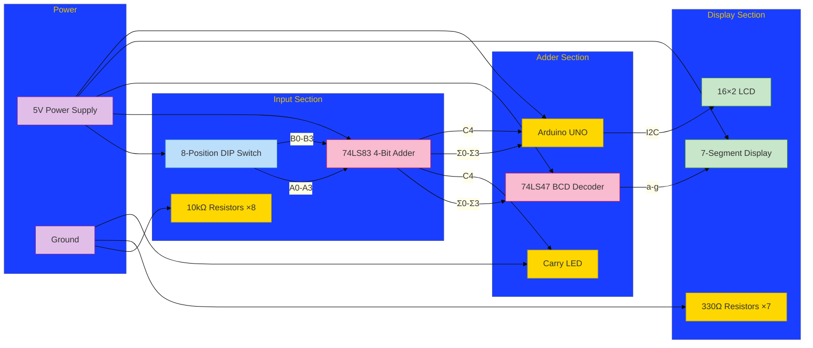

# Hardware Schematic: 4-Bit Adder Circuit



## Detailed Connection Guide

### 74LS83 Adder IC Connections
| 74LS83 Pin | Connection               | Description           |
|------------|--------------------------|-----------------------|
| A0-A3      | DIP Switch (Bits 0-3)    | Input A (LSB to MSB) |
| B0-B3      | DIP Switch (Bits 4-7)    | Input B (LSB to MSB) |
| C0         | GND                      | Carry-in (always 0)  |
| Σ0-Σ3      | 74LS47 A0-A3 & Arduino   | Sum outputs          |
| C4         | LED+Resistor & Arduino A4| Carry-out            |
| VCC (16)   | 5V                       | Power supply         |
| GND (8)    | Ground                   | Ground              |

### 74LS47 Decoder Connections
| 74LS47 Pin | Connection               | Description          |
|------------|--------------------------|----------------------|
| A0-A3      | 74LS83 Σ0-Σ3             | Sum inputs (LSB-MSB)|
| a-g        | 7-Segment cathodes       | Segment outputs     |
| LT (3)     | 5V                       | Lamp Test (always ON)|
| RBI (4)    | 5V                       | Ripple Blanking     |
| BI (5)     | 5V                       | Blanking Input      |
| VCC (16)   | 5V                       | Power supply        |
| GND (8)    | Ground                   | Ground              |

### 7-Segment Display Connections
| Segment | 74LS47 Pin | Arduino Pin | Description          |
|---------|------------|-------------|----------------------|
| a       | 13         | -           | Top horizontal      |
| b       | 12         | -           | Top-right vertical  |
| c       | 11         | -           | Bottom-right vertical|
| d       | 10         | -           | Bottom horizontal   |
| e       | 9          | -           | Bottom-left vertical |
| f       | 15         | -           | Top-left vertical   |
| g       | 14         | -           | Middle horizontal   |
| COM     | 5V         | -           | Common Anode        |

### Arduino Connections
| Arduino Pin | Connection      | Description              |
|-------------|-----------------|--------------------------|
| A0          | 74LS83 Σ0       | Sum bit 0 (LSB)         |
| A1          | 74LS83 Σ1       | Sum bit 1               |
| A2          | 74LS83 Σ2       | Sum bit 2               |
| A3          | 74LS83 Σ3       | Sum bit 3 (MSB)         |
| A4          | 74LS83 C4       | Carry-out               |
| SDA         | LCD SDA         | I2C Data                |
| SCL         | LCD SCL         | I2C Clock               |
| 5V          | LCD VCC         | Power                   |
| GND         | LCD GND         | Ground                  |

## Schematic Notes

1. **Pull-down Resistors**:
   - All DIP switch inputs require 10kΩ pull-down resistors
   - Connect between switch output and GND

2. **Current Limiting**:
   - 330Ω resistors on all 7-segment cathodes
   - 330Ω resistor on carry LED anode

3. **Power Considerations**:
   - Use stable 5V power supply (2A recommended)
   - Add 100nF decoupling capacitors near IC power pins
   - Connect all grounds to common point

4. **Display Compatibility**:
   - 7-segment must be Common Anode type
   - LCD must be I2C type (address 0x27)

5. **Important Signal Paths**:
   ```mermaid
   flowchart LR
       Input[DIP Switch] --> Adder[74LS83]
       Adder -->|Sum| Decoder[74LS47]
       Adder -->|Sum/Carry| Arduino
       Decoder --> Display[7-Segment]
       Arduino --> LCD
   ```

## Design Validation Checks
1. Verify Σ0 (LSB) connects to A0 on both 74LS83 and 74LS47
2. Confirm all ICs have direct 5V and GND connections
3. Check that 7-segment common anode connects to 5V (not GND)
4. Ensure carry LED has current-limiting resistor
5. Validate I2C address (0x27) matches LCD module

This schematic provides a complete implementation of your 4-bit adder with dual displays. For PCB design, maintain trace separation between digital signals and power lines to minimize noise.
